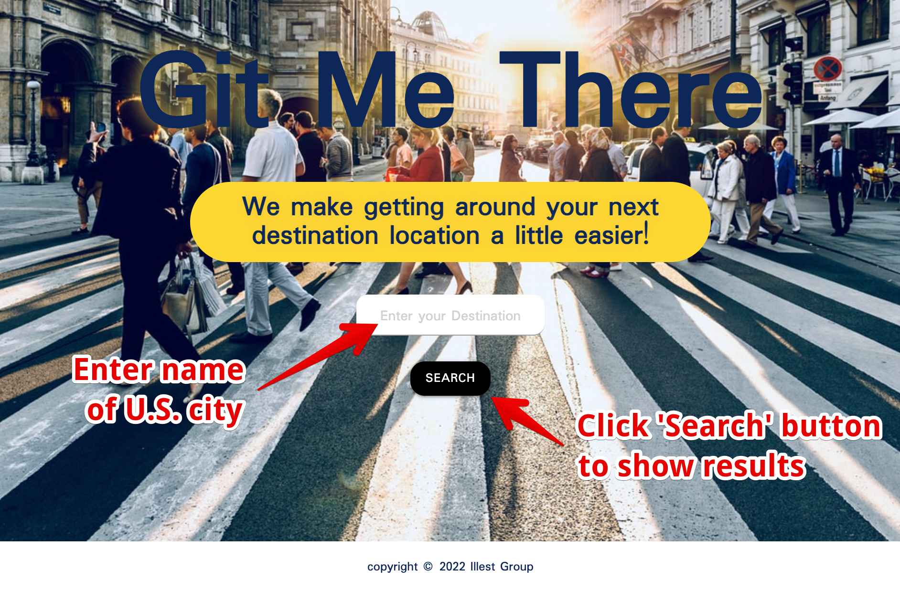
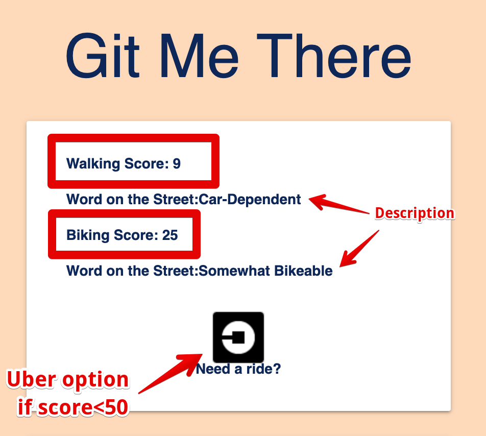
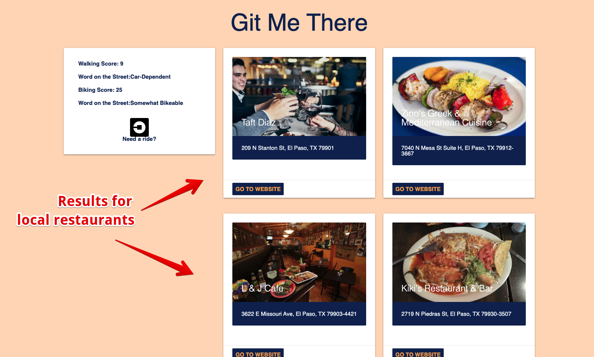
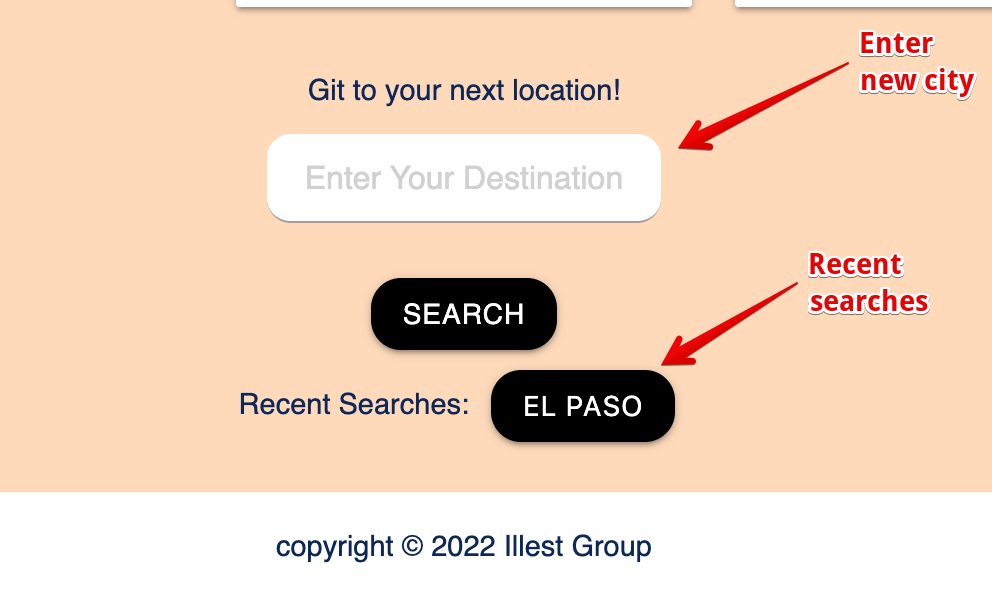

# Git Me There

## Deployed Link
[Git Me There](https://missatrox44.github.io/git-me-there/) 
[Original Deployment](https://andcooke.github.io/git-me-there/)  
Original Deployment Date - July 12, 2022

## Description
Git Me There was created for users to plan their transportation needs for upcoming trips. A user simply types in the location of any U.S. city and will be given a walking score, biking score, and restaurants nearby. If the walking score is below 50, a link to reserve a ride with Uber will appear.

## Table of Contents
- [Concept](#Concept)  
- [Resources](#Resources)
- [Usage](#Usage)
- [Challenges](#Challenges)
- [Successes](#Successes)
- [Future Development](#Future)
- [Contributing](#Contributing)
- [Questions](#Questions)

## Concept
The concept for Git Me There came about when one of our team members took an ill-fated trip to Ibiza. He spent €300 on a rental car for 3 days, thinking it was necessary. He soon found out he could walk everywhere. He later said, “It was more inconvenient to have the car than if I just walked around.”

We wanted to build on this concept by adding information about local restaurants and potential lodging and local attractions. A traveler could visit Git Me There, type in any city, and after a few moments be given some of this information.

# Resources
- [Materialize](https://materializecss.com/) 
- [Rapid API](https://rapidapi.com/apidojo/api/travel-advisor/) 
- [Walk Score API](https://www.walkscore.com/professional/api.php) 
- HTML  
- CSS  
- JavaScript

## Usage
This site can be accessed on any device connected to the internet. The landing page contains a search bar where the user can enter any U.S. city then click the 'search' button to see results.

The user will be redirected to another page where a Walking Score and Biking Score will be presented. If either score is below 50, a link for uber will appear.

Local eateries are also populated as suggestions for users to visit.

The user can search another destination at the bottom of the page. The user can also view previous searches.

## Challenges
- Deciding on project
- API calls have limit
- API paid subscriptions
- CSS Framework Documentation
- Working collaboratively on GitHub

## Successes
- API information printed on website
- Clear team communication
- Excellent rapport with members
- Deployed website

## Future Development
- City name validation
- Speed up API response
- Enable walk score to work for cities outside of America
- Tourist attractions
- AirBnB/hotel options
- Links to local bike/scooter rentals
- Restaurant cards open directions in user's map app
- Google Maps API to show all restaurants in a given location

## Contributing
[Kyle Baca](https://github.com/kyle-david1) 
[Sara Baqla](https://github.com/missatrox44) 
[Andrew Cooke](https://github.com/andcooke) 
[Jordan Nadal](https://github.com/jnadal22) 
[Lamont Walker](https://github.com/Lwalker429)

## Questions
What can the developers do to improve this site? Please offer your suggestions to the developers.

Github username: [missatrox44](https://github.com/missatrox44)  
Email: missatrox44@gmail.com

    

    

